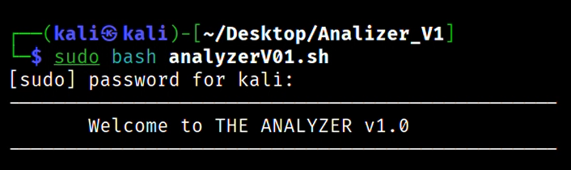
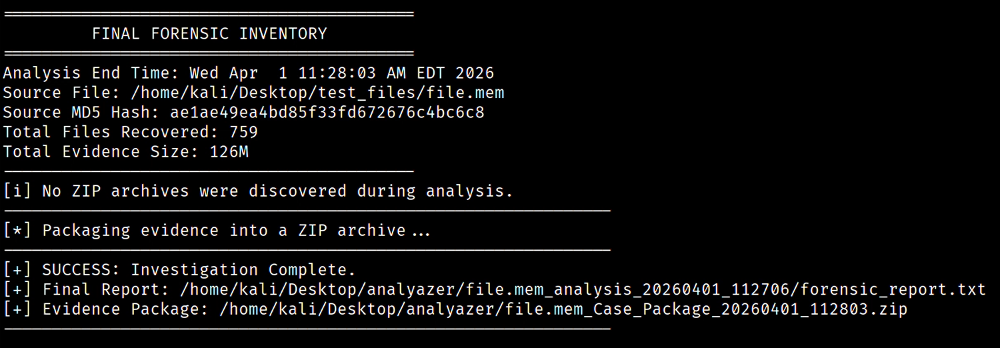

# THE ANALYZER v1.0
### Digital Forensics Pipeline for HDD and Memory Analysis

> **Course:** Cyber Magen (TMagen773638) — John Bryce Training, Tel Aviv  
> **Author:** Uri Wertheim  
> **Lecturer:** Natalie Erez  

---

## Overview

THE ANALYZER is an automated, end-to-end digital forensics pipeline designed for "Triage-to-Package" evidence analysis. It eliminates manual tool configuration, reduces human error, and ensures forensic integrity through automated MD5 hashing.

Given a memory dump or HDD image, THE ANALYZER runs a full investigation — from surface triage to deep memory forensics — and delivers a structured, packaged evidence archive ready for a lead investigator or client.

---

## The Funnel Strategy

```
Surface Triage        →  Rapidly extracting human-readable patterns (passwords, IPs, emails)
Physical Reconstruction →  Carving fragmented & deleted files from raw storage
Logical Analysis      →  Reconstructing the "living" state of the machine via memory forensics
```

---

## Features

- **Self-Healing Setup** — Auto-installs Python 3, pip3, Volatility 3, Foremost, and Bulk Extractor if missing
- **MD5 Integrity Hashing** — Source file is hashed before analysis to guarantee evidence is untampered
- **Custom Keyword Hunting** — Inject targeted search terms (usernames, malware names, domains) into the Strings module
- **Automated Alerting** — Flags suspicious processes and paths with `[ALERT]` tags in the final report
- **Modular Pipeline** — Each analysis phase runs independently; failure in one does not affect the others
- **Forensic Report** — All findings aggregated into a single `forensic_report.txt`
- **Evidence Packaging** — Full investigation compressed into a timestamped `.zip` archive for delivery

---

## Tools & Plugins

| Tool / Plugin | Role |
|---------------|------|
| `Strings` (Custom) | Surface triage — extracts human-readable text, passwords, IPs, emails |
| `Foremost` | Physical carving — reconstructs deleted/orphaned files from raw disk based on headers/footers |
| `Bulk Extractor` | Feature extraction — finds PCAP files, credit card numbers, emails that file-based carvers miss |
| `Volatility 3` | Memory forensics engine |
| `Vol: windows.info` | Identity check — OS version, architecture, system time |
| `Vol: pslist` | Execution audit — identifies active, hidden, or malicious processes |
| `Vol: netscan` | Network forensics — active TCP/UDP connections and C2 callbacks |
| `Vol: cmdline` | Intent discovery — reveals exactly what the user or malware executed |
| `Vol: hivelist` | Registry mapping — locates SYSTEM, SAM, SOFTWARE hives |

---

## Pipeline Flow

```
1. Initialization       → Dependency check + auto-install + analysis folder creation
2. MD5 Hashing          → Source file hashed for forensic integrity
3. Strings Triage       → Extract human-readable artifacts + custom keyword search
4. Physical Carving     → Foremost reconstructs deleted files from raw storage
5. Bulk Extraction      → High-speed artifact identification (emails, PCAP, credit cards)
6. Memory Forensics     → Volatility 3 plugins analyse memory dump
7. Reporting & Packaging → forensic_report.txt aggregated → timestamped ZIP archive
```

---

## Usage

```bash
# Run with admin privileges
sudo bash analyzerV01.sh
```

The interactive CLI will guide you through:
1. **Evidence file path** — provide the full path to your `.mem` or HDD image
2. **Custom keywords** — type usernames, malware names, or domains separated by spaces (or skip)
3. The tool handles everything else automatically

---

## Reading the Results

All findings are saved in a timestamped analysis folder (e.g. `file.mem_analysis_20260401_112706`):

| Artifact | Location | Contents |
|----------|----------|----------|
| `forensic_report.txt` | Analysis root | Master report — MD5 hash, Foremost breakdown, Volatility triage, Bulk summary |
| `_STRINGS/` | Analysis root | Custom keyword `.txt` files + Top 30 highlights |
| `FOREMOST/` | Analysis root | Carved files by type (JPG, PDF, EXE, DLL...) |
| `BULK/` | Analysis root | Bulk Extractor artifacts |
| `Volatility_Data/` | Analysis root | Output from all Volatility plugins |
| `*.zip` | Parent directory | Complete forensic package ready for delivery |

> Look for `[ALERT]` tags in `forensic_report.txt` to quickly identify suspicious processes or execution paths.

---

## Technical Challenges & Solutions

| Challenge | Solution |
|-----------|---------|
| Dead APT mirrors blocking installation | `--fix-missing` flag implemented to bypass unreachable package mirrors |
| PEP 668 Python environment block | `--break-system-packages` flag used to install Volatility 3 globally in the VM |
| Infinite loop ZIP error (path recursion) | Subshell navigation (`cd $PARENT && zip`) packages evidence from outside the target directory |

---

## Target Environment

- **Primary OS:** Kali Linux (Rolling Release)
- **Compatibility:** Debian-based distributions (Ubuntu, Mint) with sudo privileges
- **Architecture:** x86_64

---

## ⚠️ Disclaimer

This tool is developed for **educational purposes** and **authorised forensic investigations only**. Use only on systems and images you own or have explicit written permission to analyse. Unauthorised use is illegal.

---
## Screenshots

### Welcome & Launch


### File Path Entry & Folder Creation


### System Check & Tool Installation


### Installing Volatility 3


### Running Strings — Interactive Keyword Hunt


### Volatility Memory Analysis Results


### Foremost Carving Results


### Final Forensic Inventory & Success


### Evidence Package — ZIP Archive & Contents

---

## Credits & Acknowledgements

**Institution:** John Bryce Training, Tel Aviv — Cyber Magen Program  
**Platform:** ThinkCyber — Learning environment and lab infrastructure  
**Mentor:** David Schiffman — Founder of ThinkCyber | RTX Red Team eXpert Program  

---

## Author

**Uri Wertheim** — Cybersecurity Student | Sound Engineer  
[GitHub](https://github.com/wertheimuri) · [LinkedIn](https://www.linkedin.com/in/uri-wertheim-48734027/)
